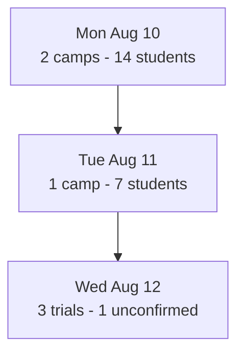

# Mobile-first director report visual contract

Present every requested operational record directly in the conversation. Keep
the report legible at phone width with short headings, compact tables or stacked
bullets, and no dependency on a generated file. A compact aggregate overview
may precede a full daily planner or multi-area weekly summary when it materially
improves the report; it never replaces the exact report sections.

Never create local HTML or emit a `visualize` content reference for a director
report. Local executor paths are unusable in remote and mobile clients. Use
standard Markdown by default. When an aggregate visual materially improves a
full director report, use only a top-to-bottom Mermaid `flowchart TB`.
Never use `timeline`, `gantt`, `xychart`, or a left-to-right flowchart in a
director report. Those layouts create wide canvases, overlapping axes, and
clipped labels in mobile Mermaid viewers.

A standalone class roster, camp-enrollment report, or family contact list is
owned by `icode-class-operations` and requires no visual overview.

## Mermaid fallback limits

- Use one chronological chain with no branches, subgraphs, crossed edges, or
  fixed width or height directives.
- Use no more than seven nodes. A daily planner normally needs today plus only
  the next material time blocks. A weekly summary uses at most one node per day.
- Keep each node to two lines and no more than 32 visible characters per line.
  Use short counts and status words in the visual; put names, full event titles,
  phone numbers, and explanations in the tables below.
- Aggregate additional records into the applicable day node. Never shrink text,
  add nodes beyond the limit, or place a complete roster or call queue inside
  the diagram.
- Include no student, guardian, lead, or other personally identifiable
  information in the visual. Use aggregate counts only.
- Use simple ASCII punctuation in Mermaid labels. Avoid long dashes, parentheses,
  Markdown emphasis, and raw line breaks that make parsing or wrapping unstable.
- Add a one-sentence accessible text summary immediately after the visual. The
  summary states the important sequence, busiest day, or urgent exception
  without repeating the detailed tables.

Example shape:

If the source data cannot support an accurate aggregate, omit the diagram and
state the source limitation. Never convert missing data into a zero count.
