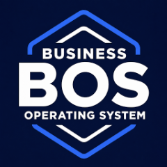

# BOS Platform for Muse Code



BOS is a service gateway: give AI agents controlled execution of complex business workflows through permissioned state machines, with your roles, rules, and approval gates. Your service infrastructure, authoritative business state and data stores, and private implementation IP stay outside the agent host. Authorized inputs and results, public skills, and permitted scoped caches can reach the agent. BOS Operations Center helps your AI workspace understand the objective, discover supported services, and present evidence; BOS retains execution authority, state, transitions, and recovery. When the required authoring and runtime contracts are available, the client can author an ad hoc dynamic workflow. BOS is the required foundation for dependent products and owns the authenticated BOS platform MCP connection. MCP discovers authorized contracts; deterministic HTTPS APIs execute the sanctioned work, with server-authorized organization, application, installation, and role selection per operation and server-enforced scope, evidence, and approvals. Availability depends on authorized discovery, configuration, and provider readiness. Access is invite-only: request an invite at https://dfsm.ai/apps/bos/#request-invite.

From a published release checkout, run:

```bash
muse plugins validate clients/muse/plugins/bos
muse plugins install clients/muse/plugins/bos
```

Merge the `mcpServers` entry from `muse-settings.template.json` into Muse's user `settings.json`.
Use `$XDG_CONFIG_HOME/muse/settings.json`, or `~/.config/muse/settings.json` when unset.
Keep `schema_version: 1`, preserve other settings and servers, and configure exactly one `BOS-Platform` entry.
If an existing BOS entry differs, review it before replacing it; remove duplicate BOS registrations through host controls.
Do not add this connection as a plugin MCP server or a project `.mcp.json`: Muse OAuth login uses user settings.

Run `muse mcp login BOS-Platform` and complete BOS consent. Muse owns token storage and refresh.
Start a new Muse process after changing connection settings. Check `/mcp` and ask BOS to list your authorized contexts.
A missing or rejected grant uses the same native login action; retain the pending task and refresh discovery afterward.

Start a new session and check `/skills` for this product's skills.
For a later published release, sync the checkout, run `muse plugins update bos`, and start a new session.
Native installation, login, discovery, and authenticated execution require separate published-release verification.
Muse native format: https://meta-models.github.io/muse-code-sdk/next/guides/plugins/reference/manifest/
Muse OAuth: https://meta-models.github.io/muse-code-sdk/next/guides/extend/mcp-servers/
