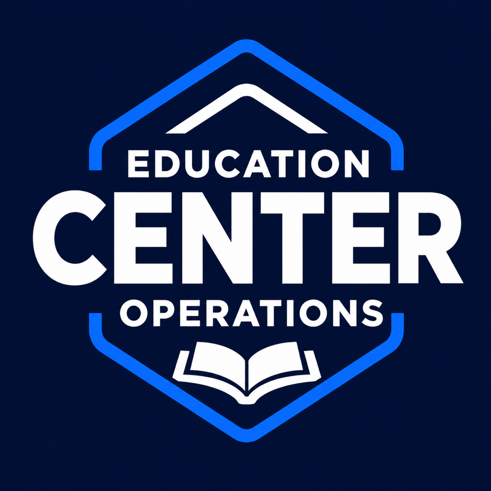

# Education Operation Center for Muse Code



Education Operation Center helps directors and adult staff at education centers coordinate instructor scheduling, family scheduling, and class scheduling; handle partner relationship interactions and invoicing; and access enrollment information and statuses through BOS. It brings focused education expertise to your AI workspace while BOS owns execution authority, business state, and permissions. Service infrastructure, authoritative data stores, and private implementation IP remain outside the agent host; authorized inputs and results, public skills, and permitted scoped caches can reach the agent. Trial reconciliation, camp capacity planning, reviewed family communications, and invoice exceptions are supporting workflow examples. In a synthetic example, Example Learning Center could reconcile example.test partnership invoices against payment records in its configured accounting system and prepare a source-linked exception ledger. Its skills can contribute domain goals and constraints to an ad hoc dynamic workflow; composition and control are owned by BOS when the required authoring and runtime contracts are available. The plugin requires BOS plus independently distributed My CRM for generic CRM records and customer journeys. Education Operation Center supplies education expertise and My CRM supplies CRM expertise, both through BOS's existing authenticated connection. Install and verify My CRM from its published guidance at https://github.com/cody-marcel-dfsm/mycrm#validate; host readiness depends on a supported distribution of the required product being available. Its deterministic workflow execution follows discovered HTTPS contracts, preserving human judgment, approvals, roles, provider boundaries, and source evidence. Available operations depend on authorized discovery, configuration, and provider readiness. Request an invite at https://dfsm.ai/apps/bos/#request-invite.

From a published release checkout, run:

```bash
muse plugins validate clients/muse/plugins/education-center
muse plugins install clients/muse/plugins/education-center
```

Install BOS first and use its single authenticated connection. This plugin contains skills and no MCP binding.
Install required independent product `my-crm` from its own distribution before using dependent workflows.
Install My CRM's independent Muse package using https://github.com/cody-marcel-dfsm/mycrm#muse-code.

Start a new session and check `/skills` for this product's skills.
For a later published release, sync the checkout, run `muse plugins update education-center`, and start a new session.
Native installation, login, discovery, and authenticated execution require separate published-release verification.
Muse native format: https://meta-models.github.io/muse-code-sdk/next/guides/plugins/reference/manifest/
Muse OAuth: https://meta-models.github.io/muse-code-sdk/next/guides/extend/mcp-servers/
